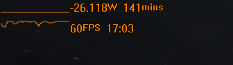

# LilPowerMan

Power manager / information display for portable Windows devices (laptops/tablets/handhelds).

## Features

- [x] Display power consumption information in the notification area

- [ ] Display battery percentage in the notification area
- [x] Display and configure TDP on Ryzen processors
- [x] Auto-switch TDP presets on game launch

- [x] Provide power information overlay for games

## Compatibility

| Device                                         | TDP Control                                                                                              | Battery icon and overlay |
|------------------------------------------------|----------------------------------------------------------------------------------------------------------|--------------------------|
| [GPD Win Max 2](https://www.gpd.hk/gpdwinmax2) | ✅ Yes                                                                                                    | ✅ Yes                    |
| Device with AMD Ryzen **and** a battery        | ⚠️ Yes, but you may need to adjust the [supported TDP list](src/main_window/controller.rs#L156) manually | ✅ Yes                    |
| Device with **no** AMD Ryzen but a battery     | ❌ No                                                                                                     | ✅ Yes                    |
| Device with AMD Ryzen but **no** battery       | ⚠️ Yes, but you may need to adjust the [supported TDP list](src/main_window/controller.rs#L156) manually | ❌ No                     |

## Alternatives / Inspiration

- [RyzenAdj](https://github.com/FlyGoat/RyzenAdj) - If all you need is TDP control.
- [Handheld Companion](https://github.com/Valkirie/HandheldCompanion) - If you need TDP control and overlay, and don't mind a few extra features.
- [Ciphray's TDP Bat menu](https://discord.com/channels/243411108940087297/1065818597844340777) - A bunch of helpful scripts, including auto-adjusting TDP based on game's FPS.
- [HWiNFO](https://www.hwinfo.com/download/) - If you're looking for simple notification area icons.

## License

[MIT License](LICENSE.md).

## Contribution

Please get yourself familiar with the [Development manual](DEVELOPMENT.md) before submitting a pull request.